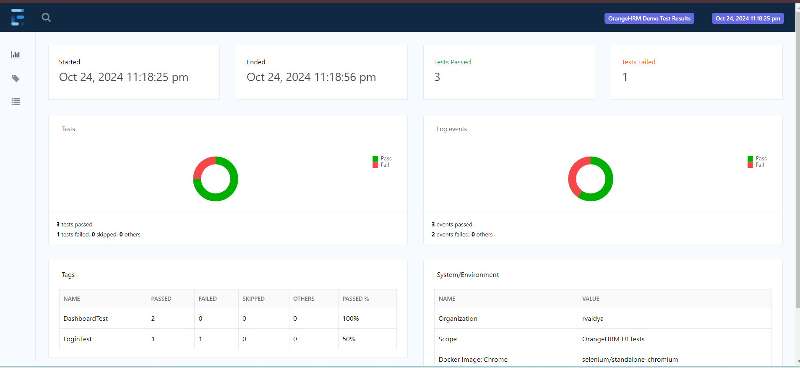
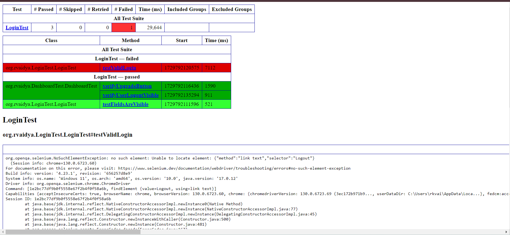
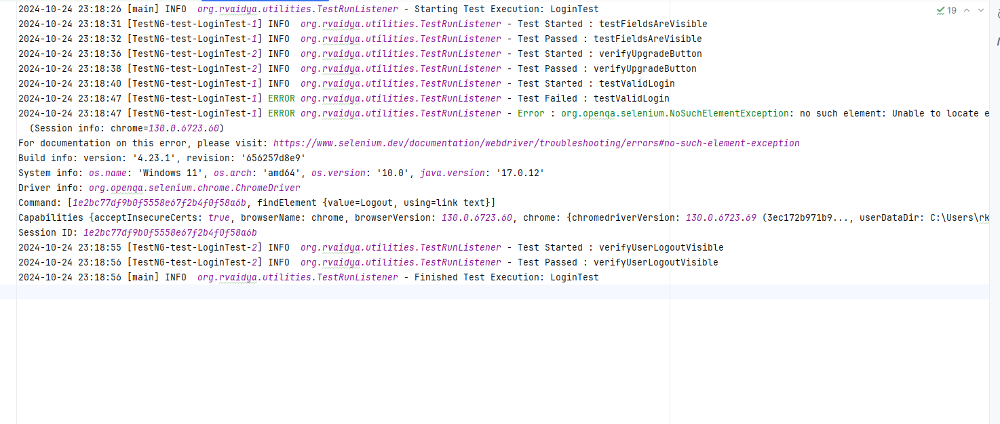

# SeleniumSharpAutomation :computer:

Automate orangeHRM using Java Selenium 4

---

### Stack:

1. Java 17
2. [Selenium 4](https://www.selenium.dev/documentation/webdriver/)
3. [Extent reports 5](https://extentreports.com/docs/versions/5/java/index.html)
4. [TestNG](https://testng.org/)
5. [GSON](https://github.com/google/gson)
6. [Apache POI](https://poi.apache.org/)
7. [DataFaker](https://www.datafaker.net/documentation/getting-started/)
8. [log4j](https://logging.apache.org/log4j/2.x/index.html)

---

### Browser support:

1. Chrome
2. Firefox

---

### Build tool:

- [Maven](https://maven.apache.org/)

---

### Steps to run

**Pre-requisites**:

1. Java 17.
2. Chrome and firefox on the system.
3. Intellij.

**Steps**:

1. clone this repo.
2. import as a project by selecting pom.xml.
3. run ``` mvn clean install -DskipTests``` to install dependencies.
4. run mvn ```mvn -q clean test``` to run tests.

---

### Automation topics covered[WIP]:

---

### Reports:

Extent:


---

testNg:



---

### Logs:


---

### CI/CD[WIP]:

---


